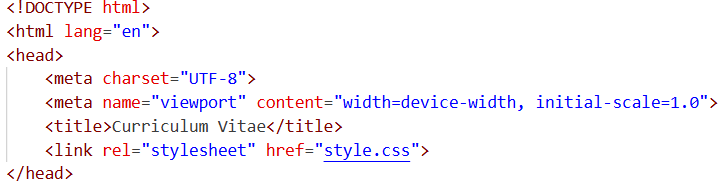

# Penjelasan Struktur HTML – Curriculum Vitae

## Deklarasi & Head

- `<!DOCTYPE html>` → menentukan dokumen sebagai HTML5.  
- `<html lang="en">` → bahasa utama halaman adalah Inggris.  
- `<meta charset="UTF-8">` → mendukung karakter internasional.  
- `<meta name="viewport" content="width=device-width, initial-scale=1.0">` → membuat halaman responsif di layar mobile.  
- `<title>` → judul halaman di tab browser.  
- `<link rel="stylesheet" href="style.css">` → menghubungkan file CSS eksternal.  

