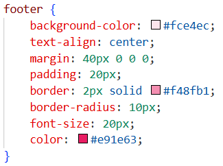

###  Laporan Praktikum
**MEMBANGUN HALAMAN WEB CURRICULUM VITAE DENGAN HTML DAN CSS**

---

###  Dosen Pengampu
Ir. Gede Humaswara Prathama, S.T., M.T.

###  Disusun Oleh
- Meizaluna Aurelia Frakasa — 42430045  

###  Institusi
Program Studi Teknologi Informasi  
Fakultas Teknik dan Informatika  
Universitas Pendidikan Nasional  
2025  

# Penjelasan Struktur HTML – Curriculum Vitae

## Deklarasi & Head

- `<!DOCTYPE html>` → menentukan dokumen sebagai HTML5.  
- `<html lang="en">` → bahasa utama halaman adalah Inggris.  
- `<meta charset="UTF-8">` → mendukung karakter internasional.  
- `<meta name="viewport" content="width=device-width, initial-scale=1.0">` → membuat halaman responsif di layar mobile.  
- `<title>` → judul halaman di tab browser.  
- `<link rel="stylesheet" href="style.css">` → menghubungkan file CSS eksternal.  

---

## Header

- `<header>` berisi nama dan profesi.  
- `<h1>` untuk nama utama → teks terbesar.  
- `
` untuk deskripsi singkat profesi (Web Developer | Graphic Designer).  

---

## Navigasi (Menu)

- `<nav>` berisi daftar tautan `<ul> <li> <a>`.  
- Terdapat 3 menu: **Biodata, Pendidikan, Skills**.  
- Link memakai anchor `href="#id"` untuk menuju ke bagian terkait di halaman.  

---

## Section Biodata

- `<section id="biodata">` → menampung informasi pribadi.  
- `<h2>` sebagai judul sub-bagian.  
- Isi berupa detail biodata: nama, alamat, telepon, email.  

---

## Section Pendidikan

- `<section id="pendidikan">` dengan judul `<h2>`.  
- Menggunakan `<ul>` untuk daftar jenjang sekolah hingga universitas.  

---

## Section Skills

- `<section id="skills">` dengan judul `<h2>`.  
- `<ul>` berisi daftar kemampuan: HTML, CSS, JavaScript, Photoshop, Illustrator.  

---

## Footer (Bagian Bawah)

- `<footer>` berisi teks dan link sosial media.  
- Tautan menuju Instagram dan TikTok.  
- Ditulis dalam satu paragraf agar ringkas: “Ikuti saya di social media: Instagram, TikTok”.  

# Penjelasan CSS

---

**Global Styling – Body**

- Selector body → menarget seluruh halaman.  
- Mengatur font dasar: Arial, fallback ke sans-serif.  
- Semua teks otomatis pakai font ini.  

---

**Header Sederhana**  

- background-color: Pink muda.  
- padding: 20px ruang dalam.  
- text-align: Isi header rata tengah.  
- Header jadi area pembuka yang rapi.  

---

**Navigasi – Daftar Utama**  

- Hilangkan bullet default.  
- Hapus padding bawaan.  
- Semua item rata tengah.  

---

**Navigasi – Item** 

 

- Item tampil berjejer horizontal.  
- Jarak antar item: 20px.  

---

**Navigasi – Link Dasar**  

 

- Link tanpa garis bawah.  
- Warna teks pink gelap.  

---

**Hover Link Umum**  

 

- Saat mouse melayang → link diberi garis bawah.  

---

**Konten Section (Box Model Dasar)**  

 

- Spasi luar 20px atas-bawah.  
- Garis tipis pink.  
- Ruang dalam 15px.  
- Bayangan lembut.  

---

**Footer Sederhana**  

 

- Latar belakang pink muda.  
- Isi footer rata tengah.  

---

**Universal Reset**  

 

- Ukuran elemen lebih mudah dikontrol (padding & border ikut dihitung).  

---

**Body Versi Lengkap**  

 

- Maksimal lebar halaman: 700px.  
- Konten di tengah (margin: 0 auto).  
- Background pink sangat muda.  

---

**Main Content**  

 

- Ruang samping dalam 15px → teks tidak menempel ke tepi.  

---

**Header Lengkap**  

 

- Tambahan border tebal 3px & radius 10px.  
- Margin bawah 30px.  
- Header jadi lebih elegan dengan bingkai melengkung.  

---

**Judul Utama**  

 

- ID #judul-utama → spesifik.  
- Warna teks gelap & tanpa margin bawaan.  

---

**Navigasi Box**

 

- Menu diberi kotak border + background pink.  
- Jarak bawah 25px.  

---

**Link Navigasi Versi Tombol** 

 

- Tambah padding supaya area klik lebih luas.  
- Border transparan → saat hover tidak menggeser layout.  
- Sudut membulat, tampil seperti tombol.  

---

**Kotak Informasi**  

 

- Kotak responsif (maks 650px).  
- Latar putih + border pink.  
- Pusat halaman dengan margin auto.  

---

**Penanda Section**  

 

- Setiap bagian punya garis kiri dengan warna berbeda.  

---

**Highlight Penting**  

 

- Blok khusus untuk info penting.  
- Garis tebal di kiri + latar pink lembut.  
- Teks tebal berwarna kontras.  

---

**Teks Skill**  

 

- Border dashed pink.  
- Latar pink muda.  
- Teks tebal → menonjolkan daftar skill.  

---

**Footer Lengkap**  

 

- Lebih elegan dengan border & radius.  
- Font lebih besar, warna teks pink gelap.  

---

**Link Sosial Media**

 

- Link otomatis diwarnai sesuai kata di URL.  
- Instagram → pink cerah, TikTok → ungu tua.  

---

**Hover Link Kedua**  

 

- Tambahan efek: warna berubah pink terang saat hover.  

---

**Hover Tombol Menu** 

 

- Border muncul saat hover.  
- Background jadi putih → tombol lebih interaktif.  

---

**Hover Kotak Info**

 

- Kotak berubah pink muda saat disentuh mouse.  

---

**Pseudo-element Heading** 

 

- Tambahkan bullet pink sebelum setiap judul H2 di dalam .kotak-info.  

---

**Responsif Tablet** 

 

- Layout jadi lebih ringkas.  
- Menu berubah vertikal.  
- Kotak info lebar penuh.  

---

**Responsif Mobile** 

 

- Judul & teks mengecil.  
- Menu lebih kecil → pas untuk layar HP.  
