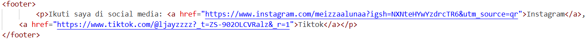

# Penjelasan Struktur HTML – Curriculum Vitae

## Deklarasi & Head

- `<!DOCTYPE html>` → menentukan dokumen sebagai HTML5.  
- `<html lang="en">` → bahasa utama halaman adalah Inggris.  
- `<meta charset="UTF-8">` → mendukung karakter internasional.  
- `<meta name="viewport" content="width=device-width, initial-scale=1.0">` → membuat halaman responsif di layar mobile.  
- `<title>` → judul halaman di tab browser.  
- `<link rel="stylesheet" href="style.css">` → menghubungkan file CSS eksternal.  

---

## Header

- `<header>` berisi nama dan profesi.  
- `<h1>` untuk nama utama → teks terbesar.  
- `
` untuk deskripsi singkat profesi (Web Developer | Graphic Designer).  

---

## Navigasi (Menu)

- `<nav>` berisi daftar tautan `<ul> <li> <a>`.  
- Terdapat 3 menu: **Biodata, Pendidikan, Skills**.  
- Link memakai anchor `href="#id"` untuk menuju ke bagian terkait di halaman.  

---

## Section Biodata

- `<section id="biodata">` → menampung informasi pribadi.  
- `<h2>` sebagai judul sub-bagian.  
- Isi berupa detail biodata: nama, alamat, telepon, email.  

---

## Section Pendidikan

- `<section id="pendidikan">` dengan judul `<h2>`.  
- Menggunakan `<ul>` untuk daftar jenjang sekolah hingga universitas.  

---

## Section Skills

- `<section id="skills">` dengan judul `<h2>`.  
- `<ul>` berisi daftar kemampuan: HTML, CSS, JavaScript, Photoshop, Illustrator.  

---

## Footer (Bagian Bawah)

- `<footer>` berisi teks dan link sosial media.  
- Tautan menuju Instagram dan TikTok.  
- Ditulis dalam satu paragraf agar ringkas: “Ikuti saya di social media: Instagram, TikTok”.  

